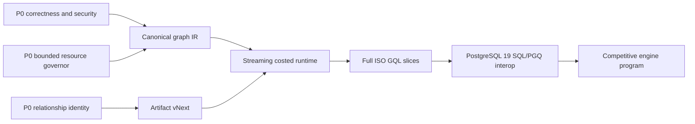

# Roadmap

<Callout type="info">
This roadmap is directional. It describes the work pgGraph is designed around,
not a dated release commitment.
</Callout>

pgGraph's roadmap keeps one boundary fixed: PostgreSQL remains the source of
truth. The target is a complete ISO GQL graph engine inside PostgreSQL, backed
by PostgreSQL-authoritative projections rather than a separate durable graph
store. Existing SQL functions remain supported frontends, SQL/PGQ has its own
standards boundary, and optional compatibility languages lower into the same
typed planner and runtime.

## Current Baseline

The current engine already supports the core SQL workflow:

| Area | Current behavior |
|---|---|
| Registration | Manual table and edge registration plus schema auto-discovery. |
| Querying | Bounded traversal, shortest paths, weighted shortest paths, path reconstruction, source search, workflow helpers, connected components, and a growing but explicitly incomplete GQL subset through `graph.gql()`. |
| Maintenance | Explicit build, persist, load, sync apply, vacuum, stats, and background job entry points. |
| Sync | Trigger-buffered change capture with explicit foreground or background apply. |
| Persistence | Atomic `.pggraph` artifacts under PostgreSQL data storage. Immutable forward graph arrays, schema-direction flags, and resolution are read-only mmap-backed on load; reverse CSR and bincode metadata are backend-local heap structures. |
| Safety | ACL preflight, SQLSTATE mapping, selected traversal circuit breakers, build-memory preflight, and panic-to-PostgreSQL-error boundaries. Hard byte budgets are not yet universal across build, load, query, sync, and compaction. |

```text
current stable core
    |
    +-- SQL-first graph queries
    +-- trigger-buffered sync
    +-- read-only mapped launch artifacts
    +-- release and safety hardening
```

## Open Source V1 Focus

The immediate open-source focus is deliberately practical: make the existing
system easy to install, easy to verify, and hard to misunderstand.

| Area | Direction |
|---|---|
| Documentation | Keep SQL user docs and Rust contributor docs in the Nextra docs tree as the single source of truth. |
| Packaging | Tighten source install, package validation, fresh install smoke tests, and PostgreSQL 14-18 release evidence. |
| CI/CD | Start with unit/static checks on every change, then add PostgreSQL-backed pgrx integration jobs, then promote heavy release gates to scheduled or manual release validation. |
| Examples | Maintain small examples for quick evaluation and realistic examples for operational guidance. |
| API clarity | Document every exported SQL function, reserved option, error class, and security boundary. |
| Operations | Keep backup/restore, crash recovery, concurrency, memory, and package checks reproducible from documented scripts. |

## Near-Term Work



| Area | Planned improvement |
|---|---|
| Correctness and security | Close coordinate-only RLS visibility, parallel-relationship identity, same-named filter identity, savepoint, and cross-backend publication gaps before broadening syntax. |
| Resource governance | Enforce hard byte/work/disk budgets across build, mmap load, query, sync, compaction, and analytics. Prefer adaptive chunks and spill to OOM. |
| Out-of-core build | Stream node, relationship, filter, resolution, outbound, and inbound runs into a validated generation-specific artifact. |
| GQL conformance | Track ISO/IEC 39075:2024 and applicable corrections in one machine-readable parser-to-docs ledger, then implement vertical feature slices until every applicable requirement is complete. |
| Planner/runtime | Replace source-order materialization with typed binding-table IR, graph/PostgreSQL statistics, cost/resource planning, streaming operators, and spillable blocking work. |
| Storage and sync | Persist both CSR directions and stable relationship/filter identities; publish snapshots with cross-backend generation compare-and-swap and source watermarks. |
| PostgreSQL 19 | Investigate native property-graph catalog and `GRAPH_TABLE` interoperation behind a versioned SQL/PGQ adapter while retaining PostgreSQL 14-18 frontends. |
| Refactoring | Decompose build, projection, binder, executor, evaluator, engine, SQL facade, sync, and test mega-modules without changing behavior during mechanical splits. |
| CI/CD rollout | First gate `cargo fmt --check`, `cargo clippy`, `cargo test`, `cargo doc`, and docs drift checks; next gate `cargo pgrx test`; final gate synthetic/heavy release scripts. |
| Competitive evidence | Publish checked workload results with latency percentiles, throughput, RSS/PSS, spill, build/load time, sync lag, storage amplification, and equivalent semantics. |

## Alpha Hardening Status

The critical-path alpha hardening pass has landed the correctness, durability,
SQL contract, sync freshness, and operator diagnostics work that was blocking a
clearer public baseline.

| Track | Status | Notes |
|---|---|---|
| Data correctness | Critical baseline landed; P0 follow-ups open | Edge endpoint and exact numeric hydration fixes landed. Parallel relationship identity and same-named filter identity are now tracked as P0 before a full property-multigraph claim. |
| SQL contract | Complete for the critical path | Weighted shortest paths return stable step rows; search and traversal pagination contracts are documented and tested. |
| Persistence safety | Critical validation landed; publication follow-up open | PK UTF-8, resolution collisions, mmap bounds, and missing `PGDATA` are validated. Replacement validation-before-switch and cross-backend generation serialization remain P0. |
| SQL boundary safety | Search hardened; GQL RLS follow-up open | Source search binds user values through SPI parameters. Coordinate-only GQL topology needs a dedicated RLS reproduction and fail-closed visibility gate. |
| Sync freshness | Complete for topology reads | Topology reads auto-apply pending trigger sync rows by default up to a captured high-water mark; `graph.query_freshness = 'off'` preserves manual mode. |
| Scheduler integration | Available | `graph.run_scheduled_maintenance()` is scheduler-safe and documented for `pg_cron` or external schedulers. The Docker image enables `pg_cron` and installs a five-minute maintenance schedule. |
| Operator diagnostics | Complete for the critical path | `graph.status()`, `graph.sync_health()`, build jobs, and maintenance jobs expose read-only reasons and progress diagnostics. |

## Continuous Improvement

There is always another way to optimize a graph engine, especially one that
runs inside PostgreSQL backend processes and must respect PostgreSQL memory,
locking, ACL, and durability semantics. The launch priority is therefore
deliberate: make the critical correctness, persistence, safety, and operational
paths work first, then continue improving performance and ergonomics in the
open.

The current public follow-up list is tracked in [Known Issues](./known-issues).
Work is ranked by user impact:

| Priority | Focus | Examples |
|---|---|---|
| P0 | Correctness, security, and hard resource bounds | RLS-safe topology, relationship/filter identity, cross-backend publication, validation-first artifacts, and bounded build/load/query/compaction. |
| P1 | Full engine foundations | Canonical IR, streaming operators, cost/resource planning, mmap-friendly artifact vNext, coherent sync watermarks, and PostgreSQL transaction completeness. |
| P2 | Standards coverage and interoperability | Full ISO GQL slices and a separate PostgreSQL 19 SQL/PGQ adapter/conformance matrix. |
| P3 | Competitive breadth and maintainability | Analytics workers, WAL sync, semantic guidance, module/core extraction decisions, and measured hot-path optimization. |

The bias is to optimize with evidence, but correctness, security, and hard
resource boundaries do not wait for a favorable benchmark. Hot-path changes
need checked workloads showing whether allocations, SPI calls, sorts, clones,
or lookups are material, plus proof that the bounded fallback remains intact.

Arena-style allocation is a possible future optimization for bounded query
scratch space, parser/binder working sets, or traversal/path reconstruction
buffers if profiling shows allocator overhead is material. It would not replace
`graph.maintenance()` or `graph.vacuum()`: those operations compact committed
sync overlays and transaction deltas into a clean immutable CSR base, while an
arena only changes how temporary memory is allocated and released inside a
backend.

## Full GQL And SQL/PGQ Standards

The normative GQL target is
[ISO/IEC 39075:2024](https://www.iso.org/standard/76120.html) plus applicable
published corrections. The project will track the in-progress
[Technical Corrigendum 1](https://www.iso.org/standard/93701.html) without
claiming support for draft text. A machine-readable feature registry will
generate capability tables and link every row to parser, binder, planner,
executor, diagnostics, security, tests, and documentation evidence.

PostgreSQL 19 documentation now includes
[property graph definitions](https://www.postgresql.org/docs/19/ddl-property-graphs.html),
[CREATE PROPERTY GRAPH](https://www.postgresql.org/docs/19/sql-create-property-graph.html),
and [GRAPH_TABLE](https://www.postgresql.org/docs/19/queries-graph.html).
pgGraph will investigate version-gated native catalog and SQL/PGQ interoperation
now, while keeping SQL/PGQ conformance separate from GQL and preserving the
PostgreSQL 14-18 SQL/GQL frontends.

Full GQL is a completion criterion, not an umbrella label for the current
subset. Until the conformance ledger is green, docs and releases will identify
the supported profile precisely.

## Semantic-Guided Search

Semantic-guided search is a distinct direction for pgGraph: combine graph
structure, relationship constraints, and pgVector-backed node embeddings to
find relevant paths without letting high-degree nodes dominate bounded
traversal.

The first shape should be a `guided_path()` style API rather than a promise of
exact A* behavior. It should keep PostgreSQL as the source of truth while
ranking candidate expansions with multiple signals:

| Signal | Purpose |
|---|---|
| Vector distance | Prefer nodes semantically closer to the target or query embedding. |
| Edge and path cost | Preserve compatibility with weighted graph search where callers have meaningful costs. |
| Degree penalty | Avoid expanding super nodes unless their semantic or structural value justifies the branching cost. |
| Edge type preference | Let callers constrain or bias search toward useful relationship classes. |
| Bidirectional expansion | Shrink the search space where directed-edge semantics allow safe forward/backward search. |
| Beam width and circuit breakers | Keep latency and memory predictable with bounded candidate sets, max-node caps, max-depth caps, and diagnostics. |

This path should be documented as approximate, relevance-ranked search. Exact
shortest-path behavior remains the job of `shortest_path()` and
`weighted_shortest_path()`.

Future work can add full A* as a specialized mode, but only for cost models
where the heuristic can be made admissible. pgVector distance alone is likely
better treated as a semantic ranking signal unless edge costs are intentionally
designed around the same metric.

## Reserved Features

Some configuration values and internals are intentionally shaped for future
work, but are not current behavior.

| Feature | Current status | Roadmap direction |
|---|---|---|
| WAL-driven sync | `graph.sync_mode = 'wal'` is reserved and rejected when selected. | Logical replication based sync for deployments that should avoid trigger-buffer volume. |
| COPY build scanner | `graph.build_scan_mode = 'copy'` is reserved and rejected when selected. | A server-side COPY scanner once it can preserve the same validation, error, and memory guarantees as the current SPI path. |
| Out-of-core build and maintenance | Low-memory rebuild mode reduces old/new overlap in the building backend, but construction, mmap load, queries, and compaction are not universally byte-bounded. | Add remaining-memory detection, adaptive byte batches, external runs/merge, streaming artifacts, mmap inbound/filter sections, bounded range compaction, and deterministic resource SQLSTATEs. |
| Relationship registration helper | `graph.add_edge()` remains the public API for FK-style and edge-table relationship registration. | Consider a dedicated many-to-many helper only if repeated post-fix user reports show the documented edge-table registration shape is still too easy to misuse. |
| Full ISO GQL | `graph.gql()` currently exposes a substantial but incomplete profile through a JSONB SQL facade. Current coverage and rejections remain documented in the query guide. | Implement every applicable ISO/IEC 39075:2024 requirement through a generated conformance ledger, correct graph identities and visibility, typed binding-table IR, cost/resource planning, streaming execution, PostgreSQL-first set-based writes, and full transaction/security gates. |
| PostgreSQL SQL/PGQ | An internal typed adapter seam exists but is not a public API. PostgreSQL 19 has native property graph and `GRAPH_TABLE` documentation. | Rebase the adapter on the canonical IR, investigate native PostgreSQL 19 property-graph catalog/interoperation behind version gates, and maintain a separate SQL/PGQ conformance matrix. |
| openCypher compatibility | `graph.cypher()` exposes only the overlapping documented subset. | Keep this as an explicitly narrow compatibility layer until full GQL foundations and evidence are complete. |
| Online mutable graph overlays | The `mutable_overlay` build mode, transaction-delta lifecycle, overlay-aware read paths, durable committed edge projection segments, PostgreSQL-first GQL node `CREATE`, PostgreSQL-first GQL relationship `CREATE` for registered edge-row mappings, PostgreSQL-first GQL property `SET`, PostgreSQL-first GQL property `REMOVE`, PostgreSQL-first GQL edge-row `DELETE`, PostgreSQL-first GQL node `DETACH DELETE`, and PostgreSQL-first GQL node `MERGE` are present. | Continue routing narrow GQL writes through PostgreSQL-first DML and transaction-local deltas while keeping `csr_readonly` as the fast read-mostly mode. |
| Full GQL writes | Current writes are intentionally narrow and PostgreSQL-first: mapped single-node/relationship `CREATE`, property `SET`/`REMOVE`, edge `DELETE`, node `DETACH DELETE`, and node `MERGE`. Writes are rejected on `csr_readonly` projections. | Implement the selected ISO data-modification features, including set-based/multi-row semantics and savepoints, through authoritative PostgreSQL DML, row locks/rechecks, `RETURNING`, transaction deltas, concurrency tests, and explicit mapping errors. Treat Cypher-shaped aliases separately in the conformance registry. |
| Non-CSR mutable projection | Durable manifest generations, immutable delta CSR segments, layered neighbor reads, compaction, generation-aware garbage collection, repair, diagnostics, and committed-edge cross-backend visibility are implemented for `mutable_overlay`. Maintenance/vacuum is still used to compact accumulated projection state back into a clean base graph. | Finish production verification, release documentation, and benchmark signoff before treating durable projection replacement as fully production-ready. |
| pgVector embedding cache | Node embeddings are not part of the graph artifact or traversal hot path. | Investigate a sidecar or persisted embedding cache keyed by internal node IDs so semantic-guided search can rank candidates without source-table lookups inside the search loop. |
| Full A* path search | Not current behavior. Existing shortest paths use bidirectional BFS and weighted paths use Dijkstra. | Consider as a specialized semantic-guided search mode only when the heuristic has an explicit admissibility contract. |
| Additional graph analytics | Connected components exist today; PageRank, Louvain, betweenness, and similar global algorithms are not built in. | Consider companion analytics paths where they fit PostgreSQL operations and do not slow the hot traversal path. |
| Distributed graph execution | Not a V1 goal. | Revisit only after the single-database engine, packaging, and operational model are mature. |

## Non-Goals

pgGraph is not trying to become:

| Non-goal | Reason |
|---|---|
| A replacement storage engine | PostgreSQL tables, indexes, constraints, ACLs, and RLS remain the system of record. |
| A separate graph database hidden inside PostgreSQL | GQL, SQL/PGQ, and compatibility frontends compile to PostgreSQL-authoritative graph projections rather than creating a second durable store. |
| Broad Cypher, Gremlin, or SPARQL compatibility | The standards direction is GQL and SQL/PGQ first. Other graph-language compatibility should be considered only as a later compatibility layer. |
| A distributed graph database | The current architecture is local to one PostgreSQL database. |
| A global analytics engine in the OLTP query path | Expensive whole-graph algorithms need different scheduling and resource controls than bounded traversal. |

## Documentation Policy

Going forward, project documentation should live under `docs/`.

- SQL behavior, installation, operations, and examples belong in
  `docs/user_guide/`.
- Rust internals, persistence, safety, memory, tests, and release process belong
  in `docs/contributor_guide/`.
- The top-level overview and system design stay directly under `docs/`.
- Quickstart and roadmap pages live directly under `docs/`; user guide and
  contributor guide pages live under `docs/user_guide/` and
  `docs/contributor_guide/`.
- Repository-local README files should stay small pointers or be removed when
  they duplicate the docs tree.
