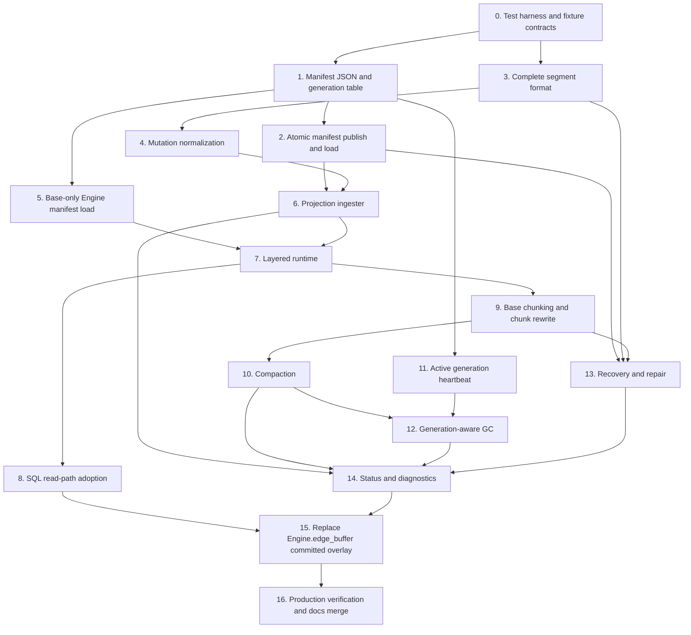

# Mutable Projection Build Order

This document breaks `todo_overview.md` into microphases. Each microphase starts
with failing tests, then implementation, then a promotion gate. The order proves
artifact safety, complete projection semantics, read correctness, cleanup, and
recovery before replacing committed backend-local `Engine.edge_buffer` behavior.

## Dependency Summary



## Architecture Rules

- Keep the implementation in the existing `graph` crate. Add projection modules
  rather than a workspace split.
- Keep PostgreSQL-facing code in SQL facade/build/sync/job modules. Keep pure
  manifest, segment, normalization, layered read, compaction, GC, and recovery
  logic in `graph/src/projection/`.
- Use direct synchronous calls inside PostgreSQL admin and maintenance
  functions. Do not introduce a Rust async runtime.
- Use typed `GraphError` variants for every new error boundary.
- Use constructor-style state passing and explicit module APIs. Do not create
  hidden mutable global projection services.
- Treat every artifact format parser as untrusted input: total validation,
  no panics, fuzz targets.
- Each promotion gate must pass before dependent microphases can be marked
  complete.
- Any microphase that can affect traversal, GQL relationship expansion,
  weighted shortest path, ingestion, compaction, GC, repair, build memory,
  artifact size, or per-backend memory must follow the regression measurement
  protocol below before promotion.

## Regression Measurement Protocol

Every performance-sensitive or memory-sensitive code change must record
evidence in the TODO folder while this implementation plan is active.

1. Capture or confirm a baseline in `todo/measurements.md`.
   - If the relevant baseline is already present, cite the existing section.
   - If the change introduces a new hot path or memory surface, add a new
     baseline before changing production code.
   - Use existing benchmark and heavy-test scripts where possible:
     `cargo bench --features pg17 --bench bfs_bench`,
     `tests/heavy/read_latency_under_sync.sh`,
     `tests/heavy/measure_build_rss.sh`, and Linux-only
     `tests/heavy/measure_mmap_pss.sh`.
2. Test for regressions after the change.
   - Compare Criterion runs with
     `cargo bench --features pg17 --bench bfs_bench -- --baseline pre_durable_projection`
     until a newer phase-specific baseline is intentionally recorded.
   - For SQL-facing latency, memory, crash, or concurrency behavior, run the
     matching heavy script and capture the summarized result.
3. Append a concise entry to `todo/regression_report.md`.
   - Include date, commit or working-tree state, command, baseline used,
     changed metric, result, and decision.
   - If a regression is accepted, include the measured reason and the release
     owner decision. Otherwise treat the regression as a blocker for the phase.
4. Append implementation progress to `todo/progress.md`.
   - Include the phase/microphase, completed work, tests run, regression report
     entry, and remaining blockers.

## Parallel Work Rules

- Microphase 1 and Microphase 3 can run in parallel after Microphase 0 defines
  shared fixture contracts.
- Microphase 5 can run after Microphase 2 while Microphase 4 and Microphase 6
  continue.
- Microphase 7 can use in-memory fake segment providers after Microphase 3, then
  must be rerun with real ingested segments after Microphase 6.
- Microphase 11 can run after Microphase 1 and before GC; deletion behavior in
  Microphase 12 depends on heartbeat data from Microphase 11.
- Microphase 14 status field design can run during Microphases 6 through 13, but
  its promotion gate requires real metrics from ingestion, chunking, compaction,
  GC, and recovery.

## Microphase 0: Test Harness And Fixture Contracts

Goal: define stable test surfaces and fixture builders before production code.

Write failing tests:

- `projection_manifest_roundtrips_base_only_generation`
- `delta_segment_roundtrips_edge_topology_weight_and_delete_sections`
- `delta_segment_roundtrips_node_resolution_filter_tenant_sections`
- `projection_ingest_committed_edge_insert_publishes_l0_manifest`
- `layered_neighbors_equal_full_rebuild_for_insert_delete_sequence`
- `status_reports_manifest_watermark_segments_chunks_gc_and_repair`

Write code:

- Add fixture helpers for temp artifact directories, manifest paths, synthetic
  sync rows, normalized mutation sequences, segment files, and full CSR rebuild
  comparison.
- Add empty test modules under the target projection modules only when
  implementing that module in the same change.

Gate:

- Failing tests fail because the production feature is absent.
- Existing test suite passes when the new failing tests are filtered by name.

## Microphase 1: Manifest JSON And Generation Table

Goal: represent a complete projection generation and active backend liveness.

Write failing tests:

- `projection_manifest_roundtrips_base_only_generation`
- `projection_manifest_rejects_missing_required_fields`
- `projection_manifest_rejects_unsupported_version`
- `projection_generation_heartbeat_expires_stale_backend`

Write code:

- Add `graph/src/projection/manifest.rs`.
- Define JSON manifest structs, version constants, required fields, checksum
  fields, segment references, base chunk references, obsolete file references,
  sync watermark, and validation status.
- Add SQL bootstrap for `graph._projection_generations`.
- Add heartbeat insert/update/expiration helpers.

Gate:

- Manifest and heartbeat tests pass.
- No query behavior changes.

Dependencies:

- Requires Microphase 0.

## Microphase 2: Atomic Manifest Publish And Load

Goal: publish and select generations atomically.

Write failing tests:

- `projection_manifest_ignores_unreferenced_temp_files`
- `projection_manifest_latest_current_generation_wins`
- `projection_manifest_publish_failure_keeps_previous_generation_current`
- `projection_manifest_rejects_missing_referenced_file`

Write code:

- Add temp-file write, file fsync, directory fsync, rename, reload, and
  validation.
- Add manifest directory scan and latest current-generation selection.
- Add typed errors for missing, corrupt, unsupported, and incomplete
  generations.

Gate:

- Publish/load tests pass.
- `python3 scripts/check_doc_references.py` passes for doc changes.

Dependencies:

- Requires Microphase 1.

## Microphase 3: Complete Segment Format

Goal: write and read every production segment kind.

Write failing tests:

- `delta_segment_roundtrips_edge_topology_weight_and_delete_sections`
- `delta_segment_roundtrips_node_resolution_filter_tenant_sections`
- `delta_segment_rejects_corrupt_offsets_checksum_and_reserved_flags`
- `delta_segment_rejects_target_out_of_range`
- `delta_segment_loader_never_panics_on_arbitrary_bytes`

Write code:

- Add `graph/src/projection/segment.rs`.
- Define binary segment header: magic, version, kind, level, direction coverage,
  source-node range, row counts, tombstone counts, sync watermark, payload
  offsets, checksum, and zeroed reserved flags.
- Implement writer/loader for edge topology inserts, edge deletes, edge weights,
  node active/tombstone deltas, resolution deltas, filter deltas, and tenant
  membership deltas.
- Add fuzz targets for manifest and segment loaders.

Gate:

- Segment unit tests pass.
- Fuzz seed corpus covers every segment kind.

Dependencies:

- Requires Microphase 0.

## Microphase 4: Mutation Normalization

Goal: convert committed mutation rows into deterministic segment contents.

Write failing tests:

- `delta_segment_normalization_is_deterministic`
- `delta_segment_normalization_cancels_insert_delete_pairs`
- `delta_segment_normalization_preserves_delete_precedence`
- `delta_segment_normalization_groups_direction_and_edge_type`
- `projection_ingest_buffer_limits_reject_oversized_batch`

Write code:

- Add `graph/src/projection/normalize.rs`.
- Sort by generation, sync-log id, source node, direction, edge type, target,
  and operation kind.
- Define cancellation and delete precedence.
- Define bounded mutation buffer with row and byte limits.

Gate:

- Normalization proptests pass.
- Segment writer accepts normalized data only.

Dependencies:

- Requires Microphase 3.

## Microphase 5: Base-Only Engine Manifest Load

Goal: load a manifest that references only the current `.pggraph` artifact
without changing graph results.

Write failing tests:

- `engine_loads_base_only_projection_manifest`
- `engine_base_only_manifest_keeps_csr_neighbors_unchanged`
- `graph_status_reports_base_manifest_generation`

Write code:

- Add projection manifest state to `Engine`.
- Load base-only manifest during artifact load when present.
- Keep `CsrNeighbors` as the active read path for base-only manifests.
- Expose base manifest generation and watermark in status.

Gate:

- Existing traversal, GQL, components, and shortest-path tests remain green.
- Base-only status tests pass.

Dependencies:

- Requires Microphase 2.

## Microphase 6: Projection Ingester

Goal: publish committed sync-log mutations into L0 segments for every
projection surface.

Write failing tests:

- `projection_ingest_committed_edge_insert_publishes_l0_manifest`
- `projection_ingest_publishes_weight_node_resolution_filter_tenant_deltas`
- `projection_manifest_watermark_advances_only_after_publish`
- `projection_ingest_aborted_gql_write_is_not_published`
- `projection_ingest_respects_build_vacuum_compaction_lock`
- `projection_ingest_concurrent_publishers_serialize`

Write code:

- Add `graph/src/projection/ingest.rs`.
- Add SQL entrypoint
  `graph.ingest_projection(max_rows bigint DEFAULT NULL, max_bytes bigint DEFAULT NULL)`.
- Read committed `graph._sync_log` rows after current manifest watermark.
- Convert source-table and GQL write rows into edge, weight, node, resolution,
  filter, and tenant mutations.
- Write and validate L0 segments.
- Publish the new manifest generation under the publication lock.
- Call ingestion from `graph.run_scheduled_maintenance()`.

Gate:

- pgrx ingestion tests and rollback heavy tests pass.
- Existing `graph.apply_sync()` and `Engine.edge_buffer` behavior remains
  active.

Dependencies:

- Requires Microphase 2 and Microphase 4.

## Microphase 7: Layered Runtime

Goal: merge base chunks, durable segments, and transaction-local deltas into one
deterministic read source.

Write failing tests:

- `layered_neighbors_equal_full_rebuild_for_insert_delete_sequence`
- `layered_neighbors_tx_delta_wins_over_durable_segments`
- `layered_neighbors_inbound_direction_matches_full_rebuild`
- `layered_neighbors_suppresses_duplicates_across_layers`
- `weighted_shortest_path_uses_durable_weight_segments`
- `layered_reads_apply_tenant_filter_and_node_visibility_segments`

Write code:

- Add `graph/src/projection/layered.rs`.
- Add `LayeredNeighbors` implementing `NeighborSource`.
- Add segment lookup by source-node range, direction, edge type, and generation.
- Merge base chunk, durable inserts, durable deletes, durable visibility
  segments, and transaction-local deltas in fixed order.
- Add durable weight lookup for weighted shortest path.

Gate:

- Unit and proptest invariants pass with fake and real segment providers.
- Existing overlay tests pass.

Dependencies:

- Requires Microphase 3.
- Real segment-provider gate requires Microphase 6.

## Microphase 8: SQL Read-Path Adoption

Goal: route public graph read surfaces through the layered runtime when a
segment-backed manifest is active.

Write failing tests:

- `traversal_uses_layered_manifest_snapshot`
- `shortest_path_uses_layered_manifest_snapshot`
- `weighted_shortest_path_uses_layered_manifest_snapshot`
- `components_use_layered_manifest_snapshot`
- `gql_relationship_expansion_uses_layered_manifest_snapshot`
- `csr_readonly_base_only_manifest_bypasses_segment_lookup`

Write code:

- Update `Engine` read helpers to select `LayeredNeighbors` for segment-backed
  manifests.
- Preserve clean CSR fast path for `csr_readonly` and base-only manifests.
- Preserve `projection::tx_delta` as the final read-your-own-writes layer.

Gate:

- Focused pgrx tests for traversal, shortest path, weighted shortest path,
  components, and GQL pass.
- Existing mutable-overlay transaction-local tests pass.

Dependencies:

- Requires Microphase 6 and Microphase 7.

## Microphase 9: Base Chunking And Chunk Rewrite

Goal: support dirty base CSR chunk rewrite and targeted repair.

Write failing tests:

- `base_chunk_manifest_roundtrips_source_node_ranges`
- `base_chunk_rewrite_preserves_full_rebuild_equivalence`
- `base_chunk_rewrite_keeps_old_generation_readable`
- `base_chunk_corruption_triggers_chunk_repair`

Write code:

- Add base chunk metadata to manifests.
- Add chunk rebuild from PostgreSQL for affected source-node ranges.
- Add chunk replacement publish path.
- Add chunk checksums and dirty pressure counters.

Gate:

- Chunk rewrite and repair tests pass.
- Full rebuild equivalence holds after chunk replacement.

Dependencies:

- Requires Microphase 7.

## Microphase 10: Compaction

Goal: reduce segment fanout while preserving read output.

Write failing tests:

- `compaction_l0_to_l1_preserves_layered_neighbors`
- `compaction_l1_to_l2_preserves_layered_neighbors`
- `compaction_preserves_tombstone_precedence`
- `compaction_dirty_chunk_rewrite_reduces_segment_pressure`
- `compaction_interruption_keeps_previous_generation_current`

Write code:

- Add `graph/src/projection/compact.rs`.
- Implement L0-to-L1 and L1-to-L2 merges.
- Implement delete/tombstone compaction.
- Trigger chunk rewrite from dirty chunk pressure.
- Add max row, byte, segment, and elapsed budgets.
- Publish compacted generation and mark replaced files obsolete.

Gate:

- Compaction preservation, boundedness, and interruption tests pass.

Dependencies:

- Requires Microphase 9.

## Microphase 11: Active Generation Heartbeat

Goal: make generation liveness explicit for concurrent PostgreSQL backends.

Write failing tests:

- `projection_generation_heartbeat_records_backend_generation`
- `projection_generation_heartbeat_refreshes_existing_backend`
- `projection_generation_heartbeat_expires_stale_backend`
- `projection_generation_heartbeat_blocks_gc_for_active_generation`

Write code:

- Record backend PID, database OID, manifest generation, heartbeat timestamp,
  and expiration interval in `graph._projection_generations`.
- Refresh heartbeat when a backend loads or continues using a generation.
- Expire stale heartbeat rows during admin/maintenance operations.

Gate:

- Heartbeat tests pass and status exposes active generation count.

Dependencies:

- Requires Microphase 1.

## Microphase 12: Generation-Aware GC

Goal: delete obsolete files only when no retained manifest or active backend can
reference them.

Write failing tests:

- `projection_gc_refuses_referenced_files`
- `projection_gc_refuses_active_generation_files`
- `projection_gc_removes_obsolete_unreferenced_segments_after_retention`
- `projection_gc_crash_does_not_invalidate_current_generation`

Write code:

- Add `graph/src/projection/gc.rs`.
- Scan retained valid manifests for referenced files.
- Combine manifest references with active heartbeat rows.
- Apply retention floor from GUC-backed config.
- Delete obsolete unreferenced files idempotently.

Gate:

- GC unit, pgrx heartbeat, and crash-shape tests pass.

Dependencies:

- Requires Microphase 10 and Microphase 11.

## Microphase 13: Recovery And Repair

Goal: recover deterministically from corrupt or missing active artifacts.

Write failing tests:

- `load_corrupt_active_segment_repairs_or_rebuilds`
- `load_missing_referenced_segment_is_rejected`
- `load_missing_unref_temp_segment_is_ignored`
- `base_chunk_corruption_repairs_from_postgresql`
- `corrupt_manifest_triggers_full_projection_rebuild`
- `full_rebuild_restores_valid_projection_generation`

Write code:

- Add `graph/src/projection/recovery.rs`.
- Add artifact validation status and recovery error variants.
- Ignore unreferenced temp files.
- Reject missing referenced files.
- Repair corrupt chunks from PostgreSQL when chunk metadata validates.
- Rebuild full projection from PostgreSQL when manifest/base/chunk metadata
  cannot support targeted repair.

Gate:

- Heavy crash/recovery script covers manifest, segment, chunk, and GC cases.

Dependencies:

- Requires Microphase 2, Microphase 3, and Microphase 9.

## Microphase 14: Status And Diagnostics

Goal: expose complete operator state through SQL.

Write failing tests:

- `status_reports_manifest_watermark_segments_chunks_gc_and_repair`
- `sync_health_distinguishes_tx_delta_edge_buffer_and_durable_projection_pressure`
- `status_reports_active_generation_heartbeat_count`
- `status_recommends_ingest_compaction_gc_or_repair_by_threshold`

Write code:

- Add `graph/src/projection/status.rs`.
- Extend `graph.status()` and `graph.sync_health()` with manifest generation,
  manifest watermark, pending durable rows, segment counts/bytes by level and
  kind, dirty chunks, tombstone ratio, compaction backlog, obsolete bytes,
  active generation count, artifact validation state, last ingestion, last
  compaction, last GC, and last repair.
- Update user and contributor docs.

Gate:

- pgrx status tests pass.
- `scripts/check_docs_drift.sh` and `python3 scripts/check_doc_references.py`
  pass.

Dependencies:

- Requires Microphase 6, Microphase 10, Microphase 12, and Microphase 13.

## Microphase 15: Replace Committed `Engine.edge_buffer` Overlay

Goal: durable segments become the committed overlay source across backends.

Write failing tests:

- `cross_backend_committed_write_visible_without_full_rebuild`
- `existing_mutable_overlay_gql_write_tests_pass_with_durable_segments`
- `tx_delta_lifecycle_passes_after_edge_buffer_replacement`
- `csr_readonly_behavior_unchanged_after_replacement`

Write code:

- Route committed edge overlay reads through durable segments.
- Keep `projection::tx_delta` for transaction-local read-your-own-writes.
- Preserve `csr_readonly` clean read path.
- Deprecate or remove `edge_buffer` status semantics after SQL compatibility
  updates.

Gate:

- Existing mutable-overlay SQL tests pass.
- Existing tx-delta heavy lifecycle tests pass.
- Cross-backend visibility test passes.

Dependencies:

- Requires Microphase 8 and Microphase 14.

## Microphase 16: Production Verification And Docs Merge

Goal: prove production readiness and remove temporary planning artifacts before
release.

Write failing/threshold tests:

- `bfs_layered_projection_no_unbounded_regression`
- `gql_layered_relationship_expansion_no_unbounded_regression`
- `weighted_path_layered_projection_no_unbounded_regression`
- `projection_ingest_publish_latency_under_threshold`
- `projection_compaction_latency_under_threshold`
- `projection_gc_latency_under_threshold`
- `projection_repair_latency_under_threshold`

Write code:

- Extend `graph/benches/bfs_bench.rs` or add focused projection benchmark
  fixtures.
- Add benchmark scenarios for base-only, small L0, many L0, compacted L1/L2,
  dirty chunk rewrite, weighted path, GQL relationship expansion, and tx-delta
  overlay on top.
- Update release evidence scripts.
- Move stable architecture and operation docs from `todo/` into `docs/`.
- Delete `todo/` before release.

Gate:

- `cargo fmt --check`
- `cargo test --features pg17`
- `cargo pgrx test pg17`
- Manifest and segment fuzz seeds run.
- Heavy crash, lifecycle, concurrency, backup/restore, and package scripts pass
  for the configured release matrix.
- Docs drift scripts pass.
- Benchmarks meet recorded thresholds or carry explicit release-owner approval
  with measured evidence.

Dependencies:

- Requires Microphase 15.

## Replacement Gate For `Engine.edge_buffer`

Committed backend-local `Engine.edge_buffer` behavior remains until every item
below is true:

- L0 ingestion publishes committed edge, weight, node, resolution, filter, and
  tenant mutations durably.
- Layered reads pass full rebuild equivalence tests.
- Weighted shortest path uses durable weight segments correctly.
- Transaction-local deltas still provide read-your-own-writes.
- Status distinguishes tx-delta pressure, `Engine.edge_buffer` pressure, and
  durable projection pressure.
- Chunk rewrite, compaction, GC, recovery, and repair gates pass.
- Cross-backend committed write visibility works without full rebuild.
- `csr_readonly` remains a clean fast path.
- Production docs describe the new operation model.

## Standard Verification Commands

Use the narrowest command that covers the changed layer:

```bash
cd graph
cargo fmt --check
cargo test --features pg17 projection::
cargo test --features pg17
cargo pgrx test pg17
```

For docs and SQL API changes:

```bash
python3 scripts/check_doc_references.py
scripts/check_docs_drift.sh
```

For crash, concurrency, and lifecycle gates, use the existing heavy scripts in
`graph/tests/heavy/`, adding manifest, segment, chunk, GC, and repair cases
when pgrx tests do not represent client/server or crash behavior.
