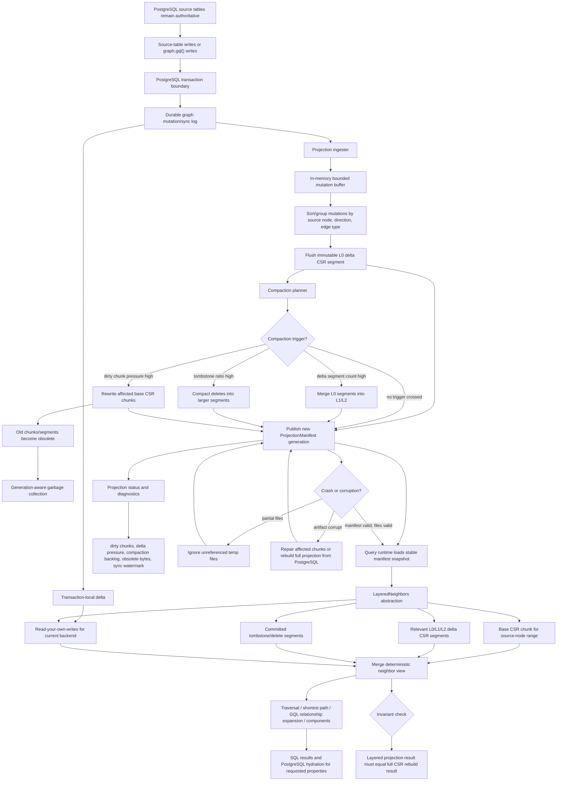

# Mutable Projection TODO Overview

This plan turns the current backend-local mutable overlay implementation into a
durable, generation-published projection stack. PostgreSQL source tables remain
the source of truth. Graph projection artifacts remain derived state that can be
validated, ignored, compacted, or rebuilt from PostgreSQL without changing the
authoritative data model.

## Current Repository Baseline

The repository already has several pieces of the target model:

- `graph._sync_log` is the durable trigger sync log created and replayed by
  `graph/src/sync.rs` and `graph/src/sql_sync.rs`.
- `graph/src/projection/tx_delta.rs` records transaction-local node, edge, and
  filter deltas for read-your-own-writes in the current backend.
- `graph/src/projection/neighbors.rs` provides the current neighbor abstraction
  for clean CSR and overlay-augmented reads.
- `graph/src/engine.rs` stores committed backend-local edge mutations in
  `Engine.edge_buffer`, exposes overlay pressure through `Engine::status()`,
  and routes traversal, unweighted shortest path, components, and read-only GQL
  relationship expansion through overlay-aware neighbor iteration.
- `graph/src/persistence.rs` writes and loads the immutable base `.pggraph`
  artifact with mmap-backed node, edge, and resolution sections.
- `graph/src/sql_build.rs` and `graph/src/sql_jobs.rs` orchestrate build,
  vacuum, maintenance, and durable maintenance job state.
- `docs/contributor_guide/sync-internals.mdx` documents the current model:
  durable source-table sync log, immutable base CSR, backend-local edge overlay,
  and maintenance rebuilds.

The production-ready target adds durable projection segments, manifest
generation publishing, cross-backend committed-delta visibility, weighted-edge
support, node/filter/tenant projection deltas, base chunk rewrites, multi-level
compaction, generation-aware garbage collection, and full crash recovery.

## Roadmap Alignment

This TODO implements the roadmap's `Non-CSR mutable projection` direction in
`docs/roadmap.mdx`. The roadmap stays public and directional. This folder is a
temporary implementation tracker that points to the roadmap, and no roadmap page
links back to this folder.

Related roadmap entries:

- `Near-Term Work / Sync operations`: ingestion, scheduling, monitoring, and
  failure handling for committed projection rows.
- `Near-Term Work / Artifact tooling`: manifest and segment
  inspection/validation for persisted artifacts.
- `Reserved Features / Online mutable graph overlays`: current shipped behavior.
  `mutable_overlay`, PostgreSQL-first GQL writes, transaction-local deltas, and
  backend-local overlays remain the compatibility baseline until the production
  replacement gate in `build_order.md` is complete.
- `Reserved Features / Non-CSR mutable projection`: target direction for this
  plan: a durable, generation-published LSM-like projection stack over an
  immutable base CSR.
- `Continuous Improvement / Query performance follow-ups`: benchmark gates for
  layered projection reads, ingestion latency, compaction latency, and memory.

Roadmap cleanup policy:

- Keep the `Online mutable graph overlays` row while `mutable_overlay` remains
  public behavior.
- Keep the `Non-CSR mutable projection` row until the phases below are merged
  into production docs as current behavior.
- Update `docs/roadmap.mdx` whenever a completed phase changes public behavior,
  SQL status fields, SQL functions, or maintenance operations.

Companion planning docs:

- `risk_analysis.md` lists the main pros, cons, failure modes, test-first risk
  gates, and production readiness risks.
- `build_order.md` breaks this plan into microphases, dependencies, parallel
  work, and promotion gates.

## Fixed Architecture Decisions

These decisions remove ambiguity from the implementation plan:

| Decision | Chosen path |
|---|---|
| Manifest encoding | Human-readable JSON with explicit version, required fields, checksums, and total validation. Segment files remain binary. |
| Segment scope | Production segments cover topology, weights, node active/tombstone state, resolution deltas, filter deltas, and tenant membership deltas. Edge topology ships before those surfaces are promoted, but production readiness requires all of them. |
| Direction storage | Durable edge segments store both forward and reverse CSR sections so inbound reads do not rebuild reverse adjacency per backend. |
| Delete representation | Deletes are first-class tombstone segments keyed by source, target, direction, edge type, and generation order. |
| Base chunking | Base CSR chunks are introduced as part of the production plan before replacing `Engine.edge_buffer`; chunk rewrites are not a separate undefined optimization. |
| Ingestion SQL entrypoint | Add `graph.ingest_projection(max_rows bigint DEFAULT NULL, max_bytes bigint DEFAULT NULL)` and call it from `graph.run_scheduled_maintenance()`. `graph.maintenance()` continues to rebuild/compact according to its existing contract and may invoke ingestion as part of a maintenance job. |
| Query-time ingestion | Queries never publish new durable segments. Query freshness may apply existing durable sync rows to backend-local state as it does today, but durable projection publication remains an admin/maintenance operation. |
| Cross-backend generation liveness | Track active manifest generations in a durable `graph._projection_generations` table with backend PID, database OID, generation id, heartbeat timestamp, and expiration interval. GC uses this table plus a retention floor. |
| Recovery policy | Loader validates active manifest and referenced files. Unreferenced temp files are ignored. Corrupt active artifacts trigger a deterministic repair path: rebuild affected chunks when chunk metadata is valid; otherwise rebuild the full projection from PostgreSQL. |
| Async model | No Rust async runtime is introduced. Ingestion, compaction, repair, and GC run synchronously inside PostgreSQL admin/maintenance calls and bounded background-worker jobs. |
| Error strategy | New projection errors use typed `GraphError` variants with SQLSTATE mapping. Loader and repair errors include artifact kind, generation id, path, and reason. No public API returns stringly typed error state. |

## Module Boundaries

Keep this in the existing `graph` crate and grow by modules, not a workspace
split. The feature belongs to the projection/persistence/sync boundary already
present in the crate.

Target modules:

- `graph/src/projection/manifest.rs`: manifest structs, JSON codec, validation,
  generation selection, and active-generation table model.
- `graph/src/projection/segment.rs`: binary segment headers, readers, writers,
  checksums, and fuzzable validation.
- `graph/src/projection/normalize.rs`: deterministic mutation normalization and
  cancellation rules.
- `graph/src/projection/ingest.rs`: sync-log-to-segment ingestion.
- `graph/src/projection/layered.rs`: `LayeredNeighbors` implementation and
  segment lookup.
- `graph/src/projection/compact.rs`: compaction planning, L0/L1/L2 merges, base
  chunk rewrites, and publish flow.
- `graph/src/projection/gc.rs`: generation-aware garbage collection.
- `graph/src/projection/recovery.rs`: artifact validation status and rebuild or
  repair orchestration.
- `graph/src/projection/status.rs`: status aggregation used by `graph.status()`
  and `graph.sync_health()`.

The SQL facade remains in `graph/src/sql_facade/admin.rs`,
`graph/src/sql_build.rs`, `graph/src/sql_jobs.rs`, and `graph/src/sql_sync.rs`.
Those modules adapt PostgreSQL calls into projection modules; projection modules
own the core state transitions and pure validation logic.

## Target Architecture

## Design Principles

- PostgreSQL source tables are authoritative; projection artifacts are cached
  derived state.
- `docs/roadmap.mdx` remains the public directional source of truth; this file
  is the repo-local implementation tracker for the mutable projection roadmap
  work.
- The existing `.pggraph` file remains the immutable base fast path while the
  segment stack is introduced additively.
- Publication is manifest-driven: query runtimes see a stable generation and
  never discover half-written segment files.
- Transaction-local deltas are never published to durable projection segments
  before PostgreSQL commit.
- Reads merge layers deterministically so graph algorithms see one logical
  neighbor stream.
- Corrupt or partial projection artifacts fail closed into repair or rebuild
  paths, never silent partial graph reads.
- Every phase starts with failing tests, then code, then promotion gates.

## Phase 1: Projection Manifest And Generation Table

Add `graph/src/projection/manifest.rs` and the durable generation table model.

Build:

- JSON manifest codec with explicit version, generation id, previous generation
  id, base artifact path/checksum/version, segment references, sync watermark,
  active chunk list, obsolete file list, creation timestamp, and validation
  status.
- `graph._projection_generations` metadata table for active generation
  heartbeat, GC retention, publish history, repair status, and sync watermark.
- Atomic manifest publish: write temp file, fsync file, fsync directory, rename,
  reload, validate, then mark generation current in PostgreSQL metadata.
- Manifest directory scan that selects the latest current generation only when
  the manifest and every referenced file validate.

Tests:

- Manifest serialization roundtrip.
- Required-field, unsupported-version, duplicate-generation, bad-checksum, and
  overlapping-segment rejection.
- Temp-file and unreferenced-file ignore behavior.
- Active-generation heartbeat insert/update/expiration behavior.
- Atomic publish test: previous generation remains selected when publish fails.

Promotion gate:

- Base-only manifest generation loads without changing current CSR query
  behavior.
- `graph.status()` can report base manifest generation and watermark.

## Phase 2: Durable Segment Format

Add `graph/src/projection/segment.rs` for all segment kinds needed by
production:

- Edge topology insert segments with forward and reverse CSR sections.
- Edge tombstone/delete segments.
- Weighted edge payload sections.
- Node active/tombstone delta segments.
- Resolution delta segments for newly materialized node ids.
- Filter delta segments for registered filter columns.
- Tenant membership delta segments for tenanted graph registrations.

Segment files contain magic, version, segment kind, level, direction coverage,
source-node range, row counts, tombstone counts, sync watermark, payload
offsets, CRC/checksum, and reserved flags that must be zero.

Tests:

- Round-trip each segment kind.
- Loader rejects corrupt headers, non-monotonic offsets, out-of-range targets,
  bad checksums, bad reserved flags, duplicate sections, and trailing payload.
- Fuzz targets cover manifest and every segment loader.
- Property tests prove loaded segment contents match normalized input.

Promotion gate:

- Segment files can be written, loaded, validated, and rejected without panics.
- The segment format supports every production projection surface listed above.

## Phase 3: Deterministic Mutation Normalization

Add `graph/src/projection/normalize.rs`.

Build:

- Deterministic ordering by generation, sync-log id, source node, direction,
  edge type, target, and operation kind.
- Insert/delete cancellation rules with delete precedence for deletes with a
  higher sync-log order.
- Duplicate suppression rules across base, durable segments, and transaction
  delta.
- Bounded in-memory mutation buffer with explicit row and byte limits sourced
  from GUC-backed config.

Tests:

- Equivalent unordered mutation inputs produce the same normalized output.
- Insert/delete pairs cancel according to sync-log order.
- Later deletes hide earlier inserts and base edges.
- Direction and edge type grouping match expected inbound, outbound, and any
  direction reads.
- Buffer limits reject oversized ingestion batches before publication.

Promotion gate:

- Normalization proptests pass and segment writer consumes normalized data only.

## Phase 4: Projection Ingester

Add `graph/src/projection/ingest.rs` and SQL entrypoint
`graph.ingest_projection(max_rows bigint DEFAULT NULL, max_bytes bigint DEFAULT NULL)`.

Build:

- Bounded read of committed `graph._sync_log` rows after the current manifest
  watermark.
- Conversion from sync rows and GQL write results into normalized edge, weight,
  node, resolution, filter, and tenant mutations.
- L0 segment writer for every supported mutation kind.
- Publish flow that validates all new segments before manifest generation
  publication.
- Maintenance-lock integration so build, vacuum, ingestion, compaction, repair,
  and GC do not publish conflicting generations.
- Scheduler integration through `graph.run_scheduled_maintenance()`.

Tests:

- Committed source-table edge insert produces L0 segments and advances manifest
  watermark.
- Aborted source-table and `graph.gql()` writes never appear in segments.
- Node, filter, tenant, resolution, edge topology, and edge weight mutations all
  publish into the correct segment kind.
- Manifest watermark advances only after referenced segments validate.
- Concurrent ingesters serialize through the publication lock.
- Build/vacuum/ingest lock conflicts return typed SQLSTATE errors.

Promotion gate:

- Durable ingestion is correct for all projection surfaces while current
  `Engine.edge_buffer` remains active as compatibility behavior.

## Phase 5: Layered Projection Runtime

Add `graph/src/projection/layered.rs` and wire it into engine read helpers.

Build:

- `LayeredNeighbors` implementing the existing `NeighborSource` contract.
- Segment index by source-node range, direction, edge type, and generation.
- Deterministic merge order: base chunk, durable inserts, durable deletes,
  durable node/filter/tenant visibility, then transaction-local deltas last.
- Weighted edge lookup over durable weight segments for weighted shortest path.
- Clean CSR fast path for `csr_readonly` and base-only manifests.

Tests:

- Layered neighbors equal full CSR rebuild for generated mutation sequences.
- Transaction-local insert/delete/filter changes win over durable segments for
  read-your-own-writes.
- Inbound, outbound, and any-direction reads match rebuilt CSR.
- GQL relationship expansion, traversal, unweighted shortest path, weighted
  shortest path, and components use the layered source when a segment manifest
  is active.
- `csr_readonly` queries do not pay segment lookup cost when no segments exist.

Promotion gate:

- All read surfaces produce the same result as full rebuild for committed
  PostgreSQL state plus current transaction-local delta.

## Phase 6: Base Chunking And Chunk Rewrite

Build base CSR chunk metadata and rewrite support before removing
`Engine.edge_buffer`.

Build:

- Base chunk list in the manifest with source-node range, checksum, edge count,
  node count, and dirty pressure counters.
- Chunk-level rebuild from PostgreSQL source tables for affected node ranges.
- Chunk replacement manifest publish.
- Chunk repair for corrupt or missing chunk artifacts.

Tests:

- Dirty chunk pressure triggers chunk rewrite.
- Rewritten chunks plus remaining segments equal full rebuild.
- Chunk replacement leaves old generation readable.
- Corrupt chunk triggers chunk repair; failed chunk repair escalates to full
  projection rebuild.

Promotion gate:

- Chunk rewrite is production-capable and covered by crash tests.

## Phase 7: Compaction Planner And Executor

Add `graph/src/projection/compact.rs`.

Build:

- L0-to-L1 and L1-to-L2 segment merge.
- Delete/tombstone compaction into larger delete segments.
- Dirty-chunk rewrite trigger using Phase 6 chunk support.
- Compaction budget controls by max rows, max bytes, max segments, and elapsed
  time.
- Manifest publication that marks replaced files obsolete and retains old
  generations.

Tests:

- L0-to-L1 and L1-to-L2 compaction preserve layered read output.
- Tombstone compaction preserves delete precedence.
- Dirty chunk rewrite reduces segment pressure and preserves full rebuild
  equivalence.
- Old and new manifests can be read concurrently.
- Interrupted compaction leaves the previous generation current.

Promotion gate:

- Compaction is correct, bounded, observable, and crash safe.

## Phase 8: Generation-Aware Garbage Collection

Add `graph/src/projection/gc.rs`.

Build:

- Referenced-file scanner over retained valid manifests.
- Active-generation liveness using `graph._projection_generations` heartbeat
  rows.
- Retention-floor policy from GUC-backed config.
- Idempotent deletion of obsolete unreferenced files.
- GC status fields and typed errors.

Tests:

- GC refuses to remove files referenced by any valid retained manifest.
- GC refuses to remove files held by an active generation heartbeat.
- GC removes obsolete unreferenced files after heartbeat expiration and
  retention floor.
- Crash during GC does not invalidate the current generation.

Promotion gate:

- Obsolete artifact cleanup is safe for concurrent PostgreSQL backends.

## Phase 9: Status, Diagnostics, And Operator Surface

Add `graph/src/projection/status.rs` and extend SQL status surfaces.

Build:

- `graph.status()` fields for active manifest generation, manifest watermark,
  pending durable sync rows above watermark, segment counts/bytes by level and
  kind, dirty chunk count, tombstone ratio, compaction backlog, obsolete bytes,
  active generation heartbeat count, artifact validation state, last ingestion,
  last compaction, last GC, and last repair.
- `graph.sync_health()` fields separating backend-local tx-delta pressure,
  backend-local `Engine.edge_buffer` pressure, and durable projection pressure.
- Docs in `docs/user_guide/sync-and-maintenance.mdx` and
  `docs/contributor_guide/sync-internals.mdx`.

Tests:

- Status before build, after build, after ingest, after compaction, after chunk
  rewrite, after GC, and after repair.
- Transaction-local pressure does not recommend durable compaction.
- Durable projection backlog recommends ingestion, compaction, GC, or repair
  according to explicit thresholds.
- Docs drift scripts pass.

Promotion gate:

- Operators can diagnose sync watermark, projection pressure, and repair state
  from SQL without filesystem inspection.

## Phase 10: Crash Recovery And Repair

Add `graph/src/projection/recovery.rs`.

Build:

- Startup validation of active manifest and all referenced files.
- Ignore policy for unreferenced temp files.
- Rejection policy for missing referenced files.
- Chunk repair from PostgreSQL when chunk metadata validates.
- Full projection rebuild from PostgreSQL when manifest, base artifact, or chunk
  metadata cannot support targeted repair.
- Post-repair manifest publication and status update.

Tests:

- Corrupt active segment reports typed rebuild/repair requirement.
- Missing referenced segment is rejected.
- Missing unreferenced temp segment is ignored.
- Corrupt chunk is repaired from PostgreSQL.
- Corrupt manifest triggers full projection rebuild.
- Full rebuild restores a valid generation and clears repair status.

Promotion gate:

- Crash and corruption behavior is deterministic, operator-visible, and
  recoverable.

## Phase 11: Compatibility Replacement And Removal Gate

Replace committed backend-local `Engine.edge_buffer` behavior only after the
durable projection stack satisfies every production invariant.

Build:

- Switch committed edge overlay reads from `Engine.edge_buffer` to durable
  segments.
- Keep `projection::tx_delta` backend-local for read-your-own-writes.
- Preserve `csr_readonly` as a clean fast path.
- Update public docs to describe durable projection behavior.
- Remove or deprecate `edge_buffer` fields only when SQL compatibility tests and
  docs reflect the new behavior.

Tests:

- Existing mutable-overlay SQL tests pass with durable committed segments.
- Existing tx-delta lifecycle heavy tests pass.
- Cross-backend committed write visibility works without full rebuild.
- `csr_readonly` behavior remains unchanged.

Promotion gate:

- Durable segments fully replace committed backend-local overlay behavior.

## Phase 12: Production Verification And Release Readiness

Make the core invariant executable:

> Layered projection result must equal a full CSR rebuild result for the same
> committed PostgreSQL source-table state plus current transaction-local delta.

Build:

- Property tests generating source graph mutations, ingestion batches,
  compaction, chunk rewrites, GC, and repair.
- SQL integration tests for trigger-driven source-table writes and
  `graph.gql()` writes.
- Heavy crash tests for temp files, corrupt files, interrupted ingestion,
  interrupted compaction, interrupted chunk rewrite, interrupted repair, and
  interrupted GC.
- Benchmarks for base-only, L0-heavy, compacted L1/L2, dirty chunk, weighted
  path, GQL relationship expansion, and tx-delta-on-top scenarios.
- Release evidence script updates.

Promotion gate:

- Unit, property, fuzz, pgrx SQL, heavy crash/concurrency, docs drift, and
  benchmark gates pass.
- The TODO implementation details are merged into production docs, and this
  temporary `todo/` folder can be deleted before release.

## Migration Strategy

1. Keep `csr_readonly` and existing `mutable_overlay` behavior passing.
2. Add base-only manifest loading and status.
3. Add complete segment formats.
4. Add normalization and bounded ingestion for every projection surface.
5. Add layered reads and prove equivalence with full rebuild.
6. Add base chunking and chunk rewrite.
7. Add compaction.
8. Add active-generation tracking and GC.
9. Add recovery and repair.
10. Switch committed overlay reads from `Engine.edge_buffer` to durable segments.
11. Update docs, status surfaces, release gates, and roadmap wording.
12. Delete this temporary TODO folder after production docs contain the final
    architecture and operation model.
